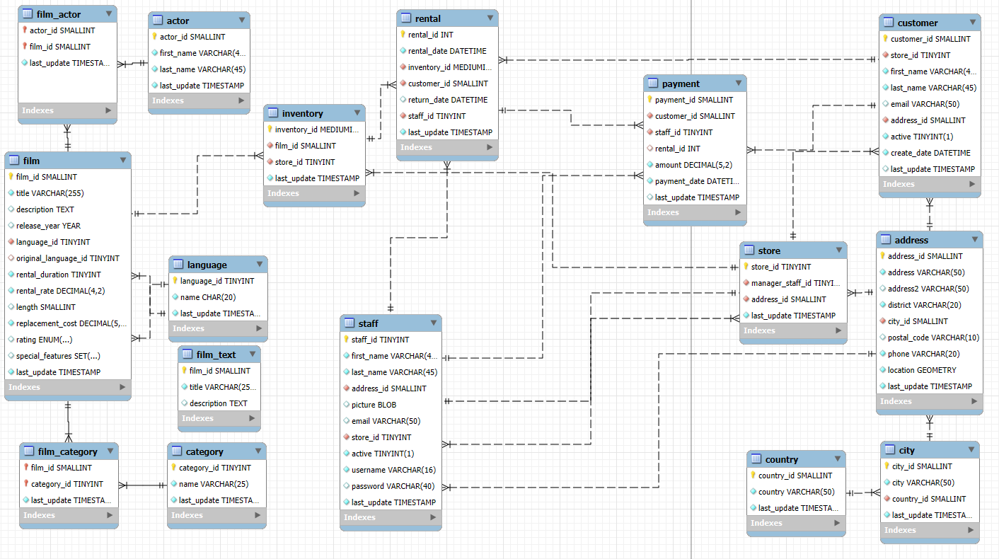
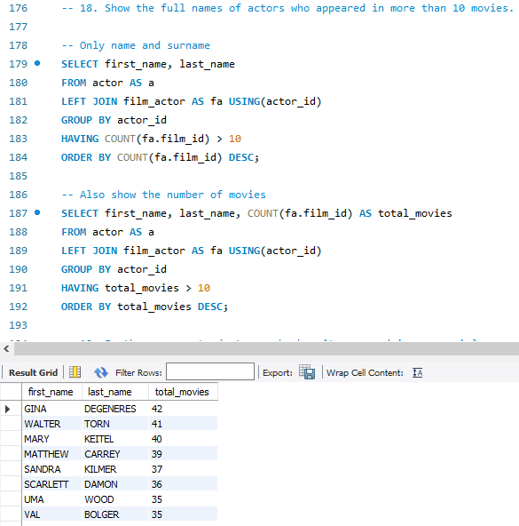

# 🎬 SQL Project - Movie Rental Database (Sakila)

This repository contains a collection of SQL queries and solutions for exploring and analyzing the [Sakila](https://dev.mysql.com/doc/sakila/en/) sample database, which simulates the structure and operations of a movie rental store.

---

## ✅ Objective

Practice and demonstrate relational database querying skills using SQL, through a set of exercises applied to the **Sakila** database.

---

## 🧠 Topics Covered

Throughout this project, the following concepts and techniques were applied:

- 📌 Basic queries with `SELECT`, `WHERE`, `LIKE`, `IN`, `BETWEEN`, `LIMIT`
- 🔗 Table relationships using different types of `JOIN`
- 🧮 Aggregation functions such as `COUNT`, `AVG`, `MIN`
- 🧠 Subqueries and aliases for improved readability
- 📊 Data grouping with `GROUP BY` and sorting with `ORDER BY`
- 🧹 Data exploration and cleaning prior to querying
- 🧱 Common Table Expressions (CTEs) for cleaner and reusable query structures

---

## 🧩 Repository Contents

```
📦 movie_sakila_sql/
├── README.md                  # Project documentation
├── movie_sakila_queries.sql  # Main file with all SQL queries
└── resources/
    ├── Diagram.PNG
    └── query_example.PNG
```

## 🚀 How to Use

1. Download or clone the repository:

   ```bash
   git clone https://github.com/juliabeco/movies_sakila_sql.git
2. Open MySQL Workbench or your preferred SQL editor.

3. Import the Sakila sample database if you haven't already. Instructions here: Install Sakila DB

4. Open and run the movie_sakila_queries.sql file to execute the queries.

---

## 🛠️ Tools Used

- MySQL Workbench
- Sakila Database

---

## 📸 Screenshots

- 🖥️ Entity-Relationship Diagram of the Sakila database



- 📊 Example Queries

```sql
-- Count the total number of movies rented by each customer and show their ID, first name, and last name.
SELECT c.customer_id AS id, c.first_name, c.last_name, COUNT(r.rental_id) AS total_rented
FROM customer AS c
LEFT JOIN rental AS r USING(customer_id)
GROUP BY id
ORDER BY total_rented DESC; -- 599 customers

-- To check which actor has the minimum number of movie appearances:
SELECT a.actor_id, COUNT(fa.film_id) AS cantidad_peliculas
FROM actor AS a
LEFT JOIN film_actor AS fa USING(actor_id)
GROUP BY a.actor_id
ORDER BY cantidad_peliculas
LIMIT 1;
```

- ✅ Example of the `.sql` file and its result



---

## 🔮 Further Work

- Add stored procedures and views for common operations
- Create visual dashboards using Power BI or Tableau
- Build Python scripts for automated querying and reporting

---


